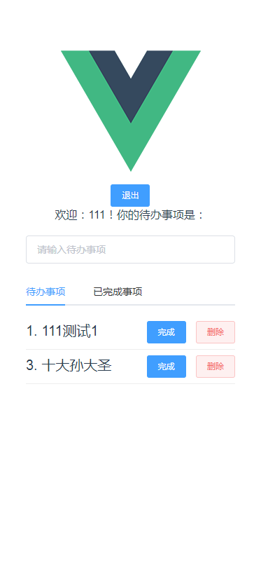
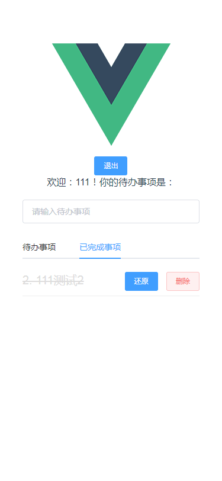

# Koa-mongoDB-Vue

> 使用Koa、mongoDB、Vue开发的一个建议的账户登录版本todoList

> 项目运行必备：node、mongoDB、robot3T

> node为运行必备环境、mongoDB为数据库、robot 3T为数据库可视化工具

> 前端在注册登录以后后台使用jsonwebtoken进行加密，返回token给前端，前端利用localstorage存储token

>每次请求前利用axios拦截器携带token后台校验token，如果过期返回特定字段，提示用户重新登录bin直接跳转登录页面，默认时间为1h

## 目录结构
> 简单说明一下: 使用vue2.x脚手架生成基本目录

> src文件下开发前端页面相关文件、根目录下koa文件存放后台接口相关代码
## Build Setup

``` bash
>>>>前端项目

# 安装依赖
npm install

# 服务端口 localhost:8080
npm run dev

>>>>后台项目
# 安装依赖
npm install

# 服务端口 localhost:3001
node app.js
```
## 登录界面 | 注册页面


## 代办事项 | 已完成事项


## token


## robot 3T 用户表


## robot 3T 事项表

